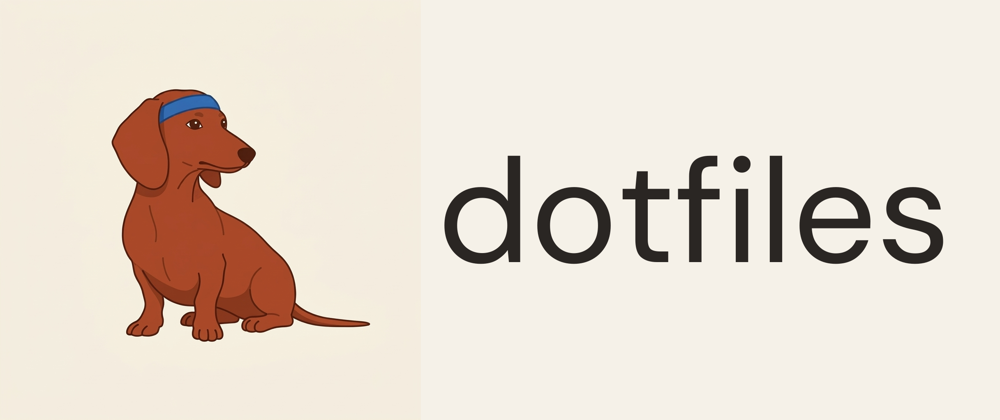

<p align="center">
  
</p>

# dotfiles

Hi! This is my personal dotfiles repo — the bits and pieces that make a fresh Mac feel like home.

It's looked after by **Dennis**, a very smooth miniature dachshund with strong opinions about terminal prompts.

## What's in the box

- Shell setup (zsh, aliases, a tidy PATH)
- Git config and handy shortcuts
- A `Brewfile` listing all the tools I like
- Claude Code settings and skills
- A small `setup.sh` that symlinks it all into place

## Bits you might actually find interesting

Most of this repo is personal plumbing, but a couple of corners are worth a look:

- **[`.claude/CLAUDE.md`](.claude/CLAUDE.md)** — my global instructions for Claude Code. Conventions for sessions, git, commits, reviews, and how I like Claude to behave across every project.
- **[`.claude/skills/`](.claude/skills/)** — a collection of custom Claude Code skills (slash commands) for things like starting and ending sessions, reviewing PRs, ping-pong TDD, and a few more. Each one is a self-contained folder with a `SKILL.md`.
- **[`.claude/docs/`](.claude/docs/)** — longer-form reference material that `CLAUDE.md` points to (git practices, jotter, subagents, web standards, etc.).

If you're poking around for ideas on how to wire Claude Code into your own workflow, start there.

## Getting started

```bash
git clone git@github.com:sebjacobs/dotfiles.git ~/Tech/Projects/personal/dotfiles
cd ~/Tech/Projects/personal/dotfiles
./setup.sh
brew bundle
```

See [`CLAUDE.md`](CLAUDE.md) for the full bootstrap walkthrough and the bits that need doing by hand.

## A note

These are *my* dotfiles — shared in the open in case anything here is useful to you, but not intended as a framework. Take what you like, leave what you don't.
